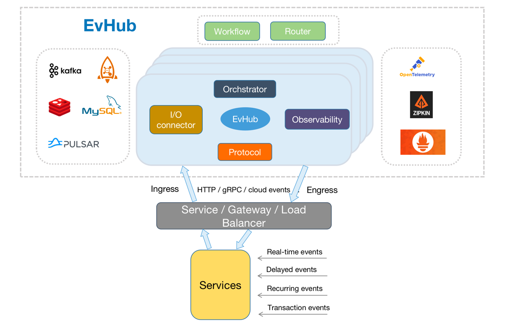

# Evhub

简体中文 | [English](README.md)

## 整体架构


事件中心通过统一的事件模型，收归异步事件，分发事件到应用场景，达到解耦上下游系统的目的。支持实时，延时、循环以及事务等事件场景，实现了高实时性，高可靠的通用事件组件。


## 特性
* 支持多协议：支持http、gRPC等多种协议
* 支持事务消息
* 支持延时事件，包括普通延迟事件和延迟处理事件
* 支持循环事件，包括普通循环事件和crontab事件
* 支持多种事件存储：Kafka、Pulsar、Mysql、redis等
* 支持多种微服务架构
* 支持高可用，易水平扩展


## 应用场景：
EvHub 可以应用于大量的场景下的数据一致性问题，以下是几个常见场景
* 削峰填谷
* 广播通知
* 缓存管理
* 系统解耦、事件驱动: 极大的简化了架构复杂性
* 分布式事务问题


### 运行EvHub

``` bash
make start
```

### 停止EvHub

``` bash
make stop
```

## 接入详解

### 配置
```bash
curl --location --request POST '127.0.0.1:8081/v1/producer' \
--header 'Content-Type: application/json' \
--data-raw '{
    "producer_conf_info":{
        "app_id":"eh",
        "topic_id":"test",
        "tx_protocol_type":0,
        "tx_address":"addr",
        "tx_callback_interval":5000
    }
}'

curl --location --request POST '127.0.0.1:8081/v1/processor' \
--header 'Content-Type: application/json' \
--data-raw '{
    "processor_conf_info":{
        "dispatcher_id":"evhub_eh_test_addr1",
        "app_id":"eh",
        "topic_id":"test",
        "timeout":5000,
        "protocol_type":"grpcSend",
        "addr":"ip:6001",
        "retry_strategy":{
            "retry_interval": 5000,
            "retry_count":3
        }
    }
}'

```

### 接入代码
``` GO
package main

import (
	"context"
	"time"

	"github.com/tencentmusic/evhub/pkg/gen/proto/comm"
	"github.com/tencentmusic/evhub/pkg/grpc"
	"github.com/tencentmusic/evhub/pkg/grpc/interceptor"
	"github.com/tencentmusic/evhub/pkg/log"

	eh_pc "github.com/tencentmusic/evhub/pkg/gen/proto/processor"
	eh_pd "github.com/tencentmusic/evhub/pkg/gen/proto/producer"
	ggrpc "google.golang.org/grpc"
)

func main() {
	serverAddr := ":6001"
	addr := "127.0.0.1:9000"
	timeout := time.Second * 5
	conn, err := grpc.Dial(&grpc.ClientConfig{Addr: addr, Timeout: timeout})
	if err != nil {
		log.Panicf("dial err:%v", err)
	}
	defer conn.Close()
	// grpc client
	rsp, err := eh_pd.NewevhubProducerClient(conn).Report(context.Background(), &eh_pd.ReportReq{
		Event: &comm.Event{
			AppId:   "eh",
			TopicId: "test",
		},
		Trigger: &comm.EventTrigger{
			TriggerType: comm.EventTriggerType_EVENT_TRIGGER_TYPE_REAL_TIME,
		},
	})
	if err != nil {
		log.Panicf("report err:%v", err)
	}
	if rsp.Ret != nil && rsp.Ret.Code != 0 {
		log.Panicf("report failed rsp:%+v", rsp)
	}
	log.Infof("report success rsp:%+v", rsp)
	StartGrpcServer(serverAddr, &Svc{})
}

type Svc struct{}

func (s *Svc) Dispatch(ctx context.Context, req *eh_pc.DispatchReq) (*eh_pc.DispatchRsp, error) {
	log.Infof("ctx:%v req:%+v", ctx, req)
	return &eh_pc.DispatchRsp{}, nil
}

func StartGrpcServer(serverAddr string, s *Svc) {
	opts := []ggrpc.ServerOption{
		ggrpc.ChainUnaryInterceptor(interceptor.DefaultUnaryServerInterceptors()...),
	}
	server := grpc.NewServer(&grpc.ServerConfig{
		Addr: serverAddr,
	}, opts...)

	eh_pc.RegisterevhubProcessorServer(server.Server(), s)
	if err := server.Serve(); err != nil {
		log.Panicf("grpc failed to serve: %v", err)
	}
}

```

### 更多示例
关于更多quick start的例子，可以参考 [quick-start-sample]()

## 联系我们
### 微信交流群
如果您希望更快的获得反馈，或者更多的了解其他用户在使用过程中的各种反馈，欢迎加入我们的微信交流群


欢迎使用[EvHub](https://github.com/tencentmusic/evhub)，欢迎star支持我们
